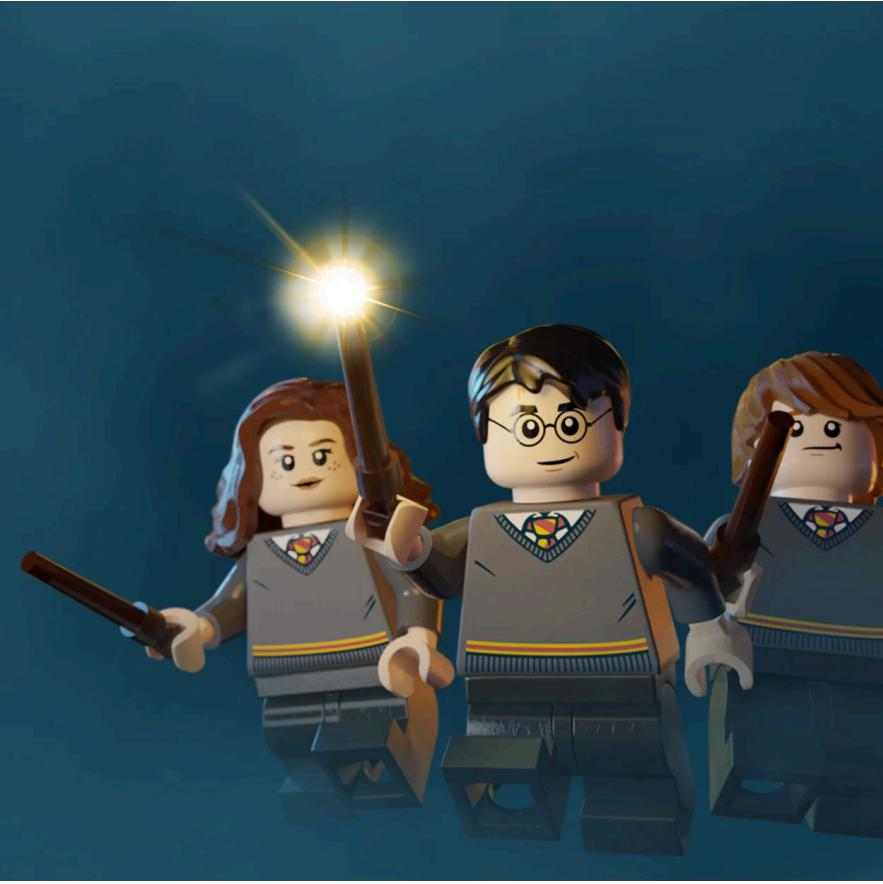
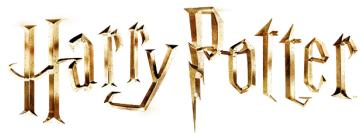
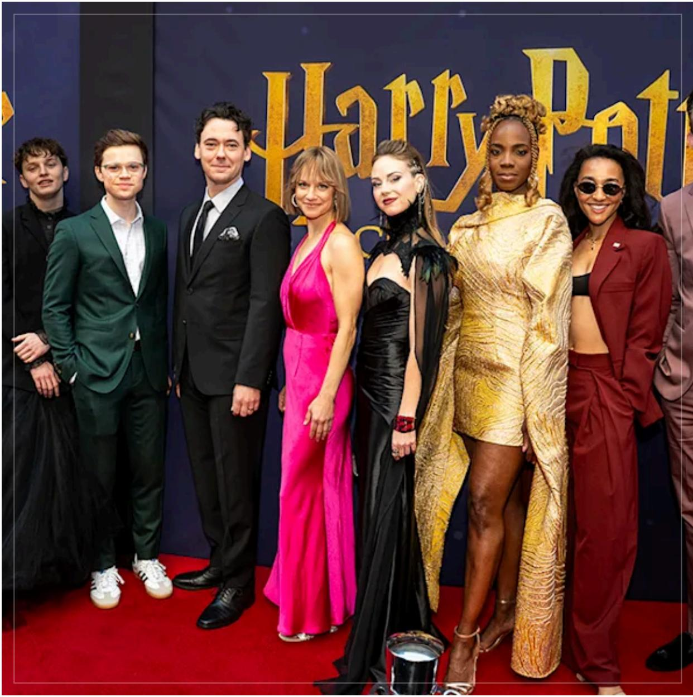
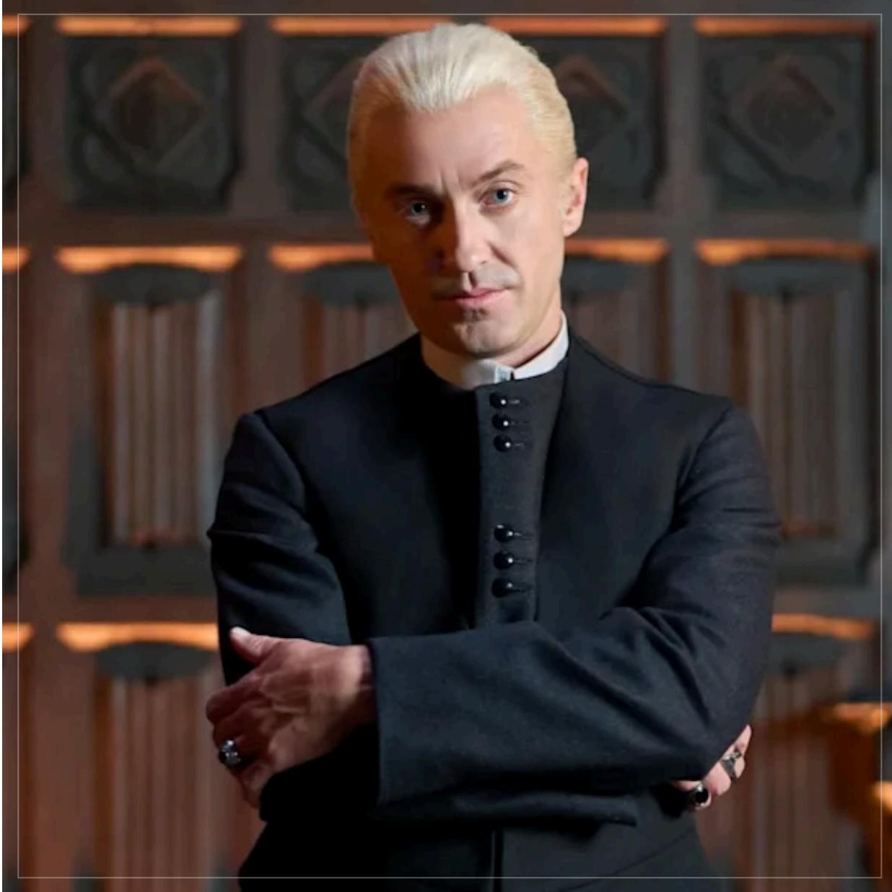

# NEWS

Get the latest Harry Potter news here. Faster than an owl and more accurate than the Daily Prophet

# LLaatteesst &t & g grreeaatteesstt

FEATURE SPOTLIGHT

The world’s fi rst LEGO   
Harry Potter land   
announced at   
LEGOLAND®   
Deutschland Resort

We can excitingly reveal that a magical new land is in the making at LEGOLAND Deutschland Resort with the

# Inside the stunning Harry Potter and the Cursed Child gala celebrating Tom Felton and the year seven cast

By The Harry Potter Editorial Team

# Tom Felton made his dazzling Broadway debut as Draco Malfoy in Harry Potter and the Cursed Child

By The Harry Potter Editorial Team

# More to explore

How to become your own wizard of baking with Wayfair

By The Harry Potter Editorial Team

# Hear Harry Potter like never before as we celebrate the launch of the new,

full-cast audio editions

By The Harry Potter Editorial Team

Every single voice you hear in Harry Potter: The Full-Cast Audio Editions

By The Harry Potter Editorial Team

Brand-new cast members revealed for star-studded Harry Potter: The

Full-Cast Audio Editions

By The Harry Potter Editorial Team

MinaLima launch new seasonal collection celebrating Honeydukes

By The Harry Potter Editorial Team

Exclusive artwork reveal and Q&A with Harry Potter and the Goblet of Fire Interactive Edition illustrator Karl

James Mountford

By The Harry Potter Editorial Team

By The Harry Potter Editorial Team

Take a trip around the wizarding world with Harry Potter: Hogwarts Mystery

By The Harry Potter Editorial Team

More cast members revealed for the star-studded Harry Potter Full-Cast Audio Editions

By The Harry Potter Editorial Team

Looking for Wizarding World? HarryPotter.com is the official home of Harry Potter, Fantastic Beasts, and the Wizarding World, formerly known as Pottermore.

Brought to you by Wizarding World Digital and its parent company Warner Bros. Entertainment Inc., delivering the latest news and official products from the Wizarding World and our partners.

All characters and elements $\circledcirc$ & TM Warner Bros. Entertainment Inc.   
Publishing Rights $\circledcirc$ J.K. Rowling.